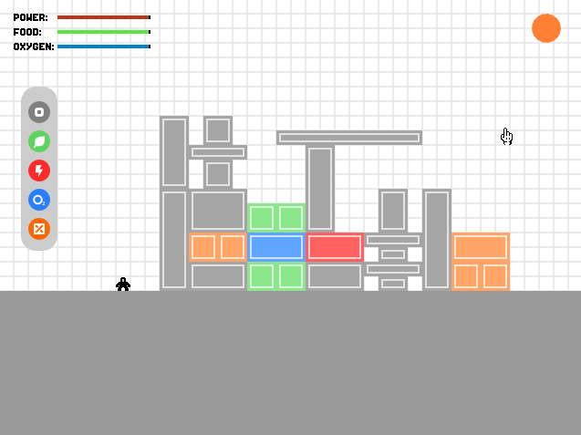

# Bunker
A soon-to-be 2D base building game written in LÖVE.

I'm not 100% sure how this game will turn out, or if I'll even get it finished, but I want to see if I can dedicate myself to completing a project by committing to it at least once a week.

**NOTE:**Progress has slowed on this project to allow me to spend more time on my school project.

#### Current Gameplay Screenshot:

  

